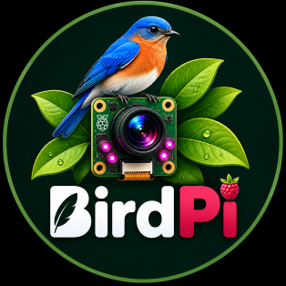

... is a Raspberry Pi based nature observation node for monitoring birds and
other small wildlife.

BirdPi uses the camera image itself for motion detection; no PIR sensor is
required. When observation is active and motion is detected, BirdPi creates an
event containing a full-resolution still image and an MP4 video.

Day/night state is calculated from the configured geographic location. BirdPi
provides two observation modes:

- **Bird** - observation during the day, standby at night
- **Wildlife** - observation during both day and night

Infrared illumination is controlled automatically from the combination of
day/night state and observation mode. WebUI and Telegram interfaces provide
status monitoring, event browsing, media management, manual controls and
runtime service control.

> Current project status
>
>  

---

## Features

- Camera-based motion detection using OpenCV
- No PIR sensor required
- Full-resolution still image per motion event
- MP4 video recording per event
- Event grouping with configurable timeout
- Automatic day/night detection using sunrise and sunset
- Configurable sunrise/sunset offsets
- **Bird** and **Wildlife** observation modes
- Automatic observation standby in Bird mode at night
- Persistent observation mode across runtime restarts
- GPIO-controlled infrared illumination
- Automatic IR control based on observation mode and day/night state
- Settling period after observation activation to avoid IR-induced false motion
- Manual image capture, video recording and IR control
- Separate runtime, WebUI and Telegram bot services
- Runtime status exchange through a JSON status file
- Runtime command channel through a local Unix socket
- Responsive Flask/Gunicorn WebUI
- Event overview and event detail pages
- Image gallery and generated thumbnails
- HTML5 MP4 video playback
- Delete individual images and videos
- Clear all images or videos
- Automatic cleanup of event references when media is deleted
- Automatic storage monitoring
- Automatic deletion of the oldest complete events when disk space becomes low
- Rotating logfiles
- systemd integration
- Telegram bot for remote status, observation mode, manual control, event browsing and service control
- Telegram access restricted to a configured chat ID
- Graceful shutdown on `SIGTERM`

---

## Architecture

BirdPi consists of three separate services:

```text
birdpi.service
    |
    +-- Camera preview
    +-- Motion detection
    +-- Observation state (Bird / Wildlife)
    +-- Day/night controller
    +-- IR lighting
    +-- Still capture
    +-- Video recording
    +-- Motion events
    +-- Runtime status
    +-- Runtime command server
    +-- Storage cleanup

birdpi-web.service
    |
    +-- Flask WebUI served by Gunicorn
    +-- Runtime status display
    +-- Bird / Wildlife selection
    +-- Manual camera and IR controls
    +-- Event browser
    +-- Gallery
    +-- Video playback
    +-- Media deletion
    +-- Start / Stop / Restart birdpi.service

birdpi-bot.service
    |
    +-- Telegram bot
    +-- Runtime and storage status
    +-- Bird / Wildlife selection
    +-- Manual camera and IR controls
    +-- Latest image / latest event
    +-- Paginated event browser
    +-- Send images and videos
    +-- Delete media
    +-- Start / Stop / Restart birdpi.service
```

The WebUI and Telegram bot do **not** initialize camera or GPIO hardware. This
avoids conflicts with the running BirdPi runtime service.

Runtime information such as camera model, day/night state, observation mode,
observation state, IR mode and motion state is written by `birdpi.service` to:

```text
birdpi-data/status/runtime.json
```

The selected observation mode is also restored from this runtime status after a
service restart. If no valid persisted mode exists, BirdPi defaults to
`bird`.

Commands from the WebUI and Telegram bot are sent to the runtime through the
local Unix socket:

```text
birdpi-data/status/birdpi.sock
```

This keeps hardware ownership inside `birdpi.service` while still allowing the
other services to control the running runtime safely.

---

# Hardware

## Raspberry Pi

BirdPi requires a Raspberry Pi with:

- CSI camera interface
- GPIO pins for IR-light control
- enough CPU performance for camera preview, OpenCV motion detection and video
  recording
- Raspberry Pi OS with the current `rpicam-*` camera tools

The project currently runs with Python 3.13.

## Camera

The current BirdPi hardware uses:

**Raspberry Pi Camera Module 3 NoIR**

Default still-image resolution:

```text
2304 × 1296
```

The NoIR version has no infrared-cut filter and can therefore be used together
with external IR illumination at night.

## Infrared illumination

The current configuration uses two independently controllable IR-light
channels:

```text
Left IR:  GPIO 20
Right IR: GPIO 21
```

The GPIO pins are control signals only.

**Do not power IR LEDs directly from Raspberry Pi GPIO pins.**

Use a suitable transistor/MOSFET driver stage and an appropriate external power
supply for the IR LEDs.

Automatic IR behavior depends on the active observation mode. The left IR
channel is enabled automatically only during **Wildlife + Night**. Bird mode
keeps IR illumination off at night because observation is in standby.

---

# Software requirements

BirdPi uses several system and Python components.

System requirements include:

- Python 3.13
- Raspberry Pi OS
- `rpicam-still`
- `rpicam-vid`
- `ffmpeg`

Python runtime dependencies declared by the project include:

- Flask
- Astral
- gpiozero
- Gunicorn
- lgpio
- NumPy
- opencv-python-headless
- python-telegram-bot

The optional ONNX object-detection code additionally uses:

- onnxruntime
- Pillow

Object detection is currently not part of the main v0.4 motion-event workflow.

Install FFmpeg system-wide:

```bash
sudo apt update
sudo apt install ffmpeg
```

Check the Raspberry Pi camera tools:

```bash
rpicam-hello --list-cameras
```

Check FFmpeg:

```bash
ffmpeg -version
```

---

# Installation

## Create a virtual environment

Example:

```bash
cd ~/birdpi
python3 -m venv .venv
source .venv/bin/activate
```

## Install BirdPi from a wheel

BirdPi uses `setuptools-scm` for version generation. The package version is
derived from Git metadata on the development computer.

The recommended release/deployment workflow is therefore:

```text
Development PC with full Git repository
    |
    +-- setuptools-scm determines the version
    |
    +-- build wheel
    |
    +-- copy wheel to Raspberry Pi
    |
    +-- install wheel into BirdPi venv
```

The Raspberry Pi itself does **not** need a Git checkout when BirdPi is deployed
as a wheel.

Build on the development computer:

```bash
python -m build
```

The generated wheel is located in:

```text
dist/
```

Example:

```text
birdpi-<version>-py3-none-any.whl
```

Copy the wheel to the Raspberry Pi and install it:

```bash
source ~/birdpi/.venv/bin/activate

pip install --force-reinstall \
    ~/birdpi/dist/birdpi-<version>-py3-none-any.whl
```

Check the installation:

```bash
pip show birdpi
```

> **Note**
>
> A source-only deployment without the repository's `.git` directory does not
> contain enough metadata for `setuptools-scm` to derive a version during an
> editable build. Building the wheel on the Git-backed development computer
> avoids this issue and is the normal BirdPi deployment path.

---

## Development directly from deployed source

If source files are deployed directly to:

```text
~/birdpi/src
```

start BirdPi from that directory when testing the current source tree:

```bash
cd ~/birdpi/src
source ../.venv/bin/activate

python -m birdpi.main
```

or:

```bash
python -m birdpi.server
```

Otherwise Python may use the installed package from:

```text
.venv/lib/python3.13/site-packages/
```

instead of the newly deployed source files.

---

# Configuration

BirdPi is currently configured in:

```text
src/birdpi/config.py
```

The most important settings are described below.

---

## Data directory

Default:

```python
data_path = Path("/home/kaulketh/birdpi-data")
```

**This must normally be changed for another user or installation.**

Example:

```python
data_path = Path("/home/pi/birdpi-data")
```

BirdPi creates and uses:

```text
birdpi-data/
├── images/
├── thumbnails/
├── videos/
├── events/
├── logs/
└── status/
    ├── runtime.json
    └── birdpi.sock
```

---

## Location

Current configuration:

```python
location_name = "HOME"
```

BirdPi uses geographic coordinates to calculate sunrise and sunset.

The configured location controls the calculated DAY / NIGHT state. That state is
then combined with the active observation mode to decide whether observation and
IR illumination should be active.

The coordinates are loaded from `LOCATIONS`:

```python
from birdpi.utils.geo import LOCATIONS
```

and converted to:

```python
LocationConfig(
    latitude=LOCATIONS[location_name].latitude,
    longitude=LOCATIONS[location_name].longitude,
)
```

For another installation, either add the desired location to `LOCATIONS` or
configure the corresponding latitude and longitude.

This setting should be reviewed before using BirdPi at another location.

---

## Camera

```python
CameraConfig(
    width=2304,
    height=1296,
)
```

These values define the still-image resolution.

The current defaults match the Raspberry Pi Camera Module 3.

---

## Video

```python
VideoConfig(
    width=1920,
    height=1080,
    framerate=30,
    duration_seconds=15,
)
```

Options:

| Setting            | Description                  |
|--------------------|------------------------------|
| `width`            | Video width                  |
| `height`           | Video height                 |
| `framerate`        | Frames per second            |
| `duration_seconds` | Recording duration per event |

BirdPi records H.264 using `rpicam-vid` and remuxes the result into MP4 using
FFmpeg.

The temporary raw H.264 file is removed afterwards.

---

## Infrared lighting

```python
IRLightConfig(
    enabled=True,
    left_pin=20,
    right_pin=21,
)
```

Options:

| Setting     | Description                                  |
|-------------|----------------------------------------------|
| `enabled`   | Reserved/configured IR capability flag       |
| `left_pin`  | GPIO for left IR channel                     |
| `right_pin` | GPIO for right IR channel                    |

The GPIO values must match the actual hardware wiring.

The current runtime logic controls IR from observation mode and day/night state.
The `enabled` field is present in the configuration but is not currently used as
a runtime gate.

---

## Motion detection

Current configuration:

```python
MotionConfig(
    pixel_threshold=40,
    min_area=4000,
    reference_interval=3,
    event_timeout_seconds=8,
)
```

### `pixel_threshold`

Minimum pixel difference considered a change.

Higher values make the detector less sensitive to small brightness changes and
image noise.

This value will usually require tuning for the actual installation.

### `min_area`

Minimum changed contour area required to trigger motion.

Higher values ignore smaller movements.

### `reference_interval`

Controls how frequently the motion detector refreshes its reference state.

### `event_timeout_seconds`

Time without additional motion before the current event is closed.

Additional motion during this interval keeps the same event alive.

BirdPi currently records one still image and one video when a new event starts.

---

## Day/night detection

```python
DaylightConfig(
    check_interval_seconds=60,
)
```

BirdPi periodically recalculates the current daylight state from the configured
geographic location.

Current sunrise/sunset offsets are:

```text
Sunrise: -20 minutes
Sunset:  +20 minutes
```

This means DAY begins 20 minutes before the calculated sunrise and NIGHT begins
20 minutes after the calculated sunset.

Day/night state alone no longer decides whether BirdPi observes or enables IR;
it is combined with the selected observation mode.

---

## Observation modes

BirdPi provides two runtime observation modes:

- `bird` - optimized for bird-house observation during daylight
- `wildlife` - continuous day/night observation

The resulting behavior is:

| Observation mode | Day/Night | Observation | Automatic IR |
|------------------|-----------|-------------|--------------|
| Bird             | DAY       | ACTIVE      | OFF          |
| Bird             | NIGHT     | STANDBY     | OFF          |
| Wildlife         | DAY       | ACTIVE      | OFF          |
| Wildlife         | NIGHT     | ACTIVE      | LEFT         |

The selected mode can be changed from the WebUI or Telegram bot. It is written
to `runtime.json` and restored when `birdpi.service` starts again.

When observation changes from standby to active, motion detection waits for a
short settling interval before accepting motion. The current interval is
**2 seconds**. This allows IR illumination and camera exposure to stabilize and
prevents the lighting change itself from immediately creating a false motion
event.

Manual runtime commands remain available while automatic observation is in
standby.

---

## WebUI

```python
WebConfig(
    refresh_interval_seconds=30,
)
```

Controls the automatic refresh interval of the WebUI status page.

The current web server listens on:

```text
0.0.0.0:5000
```

Typical access from another device on the same network:

```text
http://<birdpi-ip>:5000
```

---

## Storage protection

BirdPi monitors the filesystem that contains the BirdPi data directory.

Current defaults:

```python
storage_min_free_percent = 20.0
storage_target_free_percent = 30.0
```

Behavior:

```text
Free space > 20 %
    -> no cleanup

Free space <= 20 %
    -> automatic cleanup starts

Cleanup
    -> delete oldest complete motion events

Cleanup stops
    -> when at least 30 % free space is available
```

A complete event cleanup removes:

- event image
- image metadata sidecar
- event video
- event JSON metadata

This prevents a forgotten BirdPi installation from filling the SD card
completely.

The WebUI displays:

- total storage
- used storage
- free storage
- usage percentage
- storage warning level

---

## Object detection

The configuration currently contains support for object detection:

```python
ObjectDetectionConfig(
    model_path=Path(
        "/home/kaulketh/birdpi/models/yolo11n.onnx"
    ),
    confidence_threshold=0.25,
    iou_threshold=0.45,
    input_size=640,
)
```

Object detection is currently **not part of the main v0.4 motion-event workflow**.

The model path must be adapted if this feature is enabled on another
installation. The optional implementation requires `onnxruntime` and `Pillow`
in addition to the normal BirdPi runtime dependencies.

The following configuration values are also currently present:

```python
detector_type = "motion"
classifier_type = "dummy"
```

These are intended for detector/classifier selection and future extensions.

---

# Motion events

A BirdPi motion event currently contains:

- event ID
- start timestamp
- end timestamp
- one full-resolution image
- one MP4 video

Example event metadata:

```json
{
  "id": "20260827_143343_886466",
  "started_at": "2026-08-27T14:33:43.886466",
  "ended_at": "2026-08-27T14:34:04.298045",
  "images": [
    "image_20260827_143343.jpg"
  ],
  "video_filename": "event_20260827_143343_886466.mp4"
}
```

If an image or video is deleted through the WebUI, the corresponding event
metadata is updated automatically.

If an event no longer contains any media, its event JSON file is deleted as
well.

---

# Web interface

The responsive WebUI provides status, observation control, manual runtime
control and media management without directly initializing camera or GPIO
hardware.

## Home

- hostname
- uptime
- CPU temperature
- camera model
- camera resolution
- stored image count
- BirdPi service state
- DAY / NIGHT state
- observation mode (`BIRD` / `WILDLIFE`)
- observation state (`OBSERVATION` / `STANDBY`)
- IR state
- motion state
- current event
- latest event
- latest image
- runtime status timestamp
- disk usage
- storage warning level
- Bird / Wildlife mode buttons
- manual image capture
- manual video start / stop
- manual IR control (`OFF`, `LEFT`, `RIGHT`, `BOTH`)

## Events

- event thumbnails
- event timestamps
- duration
- video status
- event detail page
- HTML5 MP4 player

## Gallery

- responsive image grid
- generated thumbnails
- image detail view
- navigation between images

## Media management

The WebUI supports:

- delete individual image
- delete all images
- delete individual video
- delete all videos

Image metadata and event references are updated automatically.

---

# Telegram bot

BirdPi includes an optional Telegram bot for remote monitoring and control.

The bot runs independently from the BirdPi runtime and does **not** initialize
camera or GPIO hardware. Runtime actions are sent to `birdpi.service` through
the same Unix command socket used by the WebUI.

It uses the same shared components as the WebUI, including `Storage`,
`RuntimeStatusStore`, `BirdPiService` and `RuntimeCommandClient`.

The bot can currently:

- show BirdPi runtime status
- show DAY / NIGHT state
- show observation mode and ACTIVE / STANDBY state
- switch between Bird and Wildlife observation modes
- show free/used storage
- show the latest image
- show the latest motion event
- browse recent events with pagination
- send event images
- send event videos
- delete individual event images or videos
- clear all stored images
- clear all stored videos
- manually capture an image
- manually start / stop video recording
- manually set IR to OFF / LEFT / RIGHT / BOTH
- start `birdpi.service`
- stop `birdpi.service`
- restart `birdpi.service`

Destructive and service-control actions use confirmation dialogs.

## Telegram configuration

The bot token and allowed chat ID are **not stored in the repository**.

BirdPi references environment-variable names:

```python
TelegramConfig(
    enabled=True,
    token_env="BIRDPI_TELEGRAM_TOKEN",
    chat_id_env="BIRDPI_TELEGRAM_CHAT_ID",
)
```

Create a protected environment file on the Raspberry Pi:

```bash
sudo mkdir -p /etc/birdpi
sudo nano /etc/birdpi/birdpi.env
```

Example:

```text
BIRDPI_TELEGRAM_TOKEN=<telegram-bot-token>
BIRDPI_TELEGRAM_CHAT_ID=<allowed-chat-id>
```

Protect the file:

```bash
sudo chmod 600 /etc/birdpi/birdpi.env
sudo chown root:root /etc/birdpi/birdpi.env
```

The configured chat ID is used as an access-control check. Messages and button
actions from other chats are ignored.

Do not commit the Telegram token to Git.

## Telegram commands

The current bot supports:

```text
/start
/status
```

`/start` opens the inline main menu.

The main menu provides access to:

```text
Observation
Latest Event
Latest Image
Events
Storage
Service
Manual Control
```

The Observation menu shows the current Bird/Wildlife mode, DAY/NIGHT state and
ACTIVE/STANDBY state. The selected mode is marked in the inline keyboard.

The status output includes:

```text
Service
Day/Night
Observation Mode
Observation
IR
Motion
Camera
Resolution
Free storage
```

Event videos can be relatively large. BirdPi therefore uses an extended
Telegram upload timeout when sending MP4 files.

---

# systemd services

BirdPi is designed to run as three separate systemd services.

## BirdPi runtime

Example:

```ini
[Unit]
Description=BirdPi Nature Observation Runtime
After=network.target

[Service]
Type=simple
User=<user>
WorkingDirectory=/home/<user>/birdpi
ExecStart=/home/<user>/birdpi/.venv/bin/python -m birdpi.main
Restart=on-failure
RestartSec=3

[Install]
WantedBy=multi-user.target
```

Save as:

```text
/etc/systemd/system/birdpi.service
```

---

## BirdPi WebUI

The production WebUI is served by Gunicorn.

Example:

```ini
[Unit]
Description=BirdPi Web Interface
After=network.target

[Service]
Type=simple
User=<user>
WorkingDirectory=/home/<user>/birdpi/src
ExecStart=/home/<user>/birdpi/.venv/bin/gunicorn \
    --workers 1 \
    --threads 4 \
    --bind 0.0.0.0:5000 \
    --access-logfile - \
    --error-logfile - \
    birdpi.web.wsgi:app
Restart=on-failure
RestartSec=3

[Install]
WantedBy=multi-user.target
```

Save as:

```text
/etc/systemd/system/birdpi-web.service
```

The WebUI should remain available even when `birdpi.service` is stopped. Do not
configure `birdpi-web.service` with `Requires=birdpi.service`.

---

## BirdPi Telegram bot

Example:

```ini
[Unit]
Description=BirdPi Telegram Bot
After=network.target

[Service]
Type=simple
User=<user>
WorkingDirectory=/home/<user>/birdpi/src

EnvironmentFile=/etc/birdpi/birdpi.env

ExecStart=/home/<user>/birdpi/.venv/bin/python -m birdpi.telegram.bot

Restart=on-failure
RestartSec=3

[Install]
WantedBy=multi-user.target
```

Save as:

```text
/etc/systemd/system/birdpi-bot.service
```

The Telegram bot is independent from the BirdPi runtime and remains available
when `birdpi.service` is stopped.

---

## Enable services

```bash
sudo systemctl daemon-reload

sudo systemctl enable birdpi.service
sudo systemctl enable birdpi-web.service
sudo systemctl enable birdpi-bot.service

sudo systemctl start birdpi.service
sudo systemctl start birdpi-web.service
sudo systemctl start birdpi-bot.service
```

Check status:

```bash
systemctl status birdpi.service
systemctl status birdpi-web.service
systemctl status birdpi-bot.service
```

---

# Remote service control

The WebUI and Telegram bot can start, stop and restart the BirdPi runtime.

To allow this without giving the WebUI unrestricted root privileges, create a
tightly restricted sudoers rule.

Open:

```bash
sudo visudo -f /etc/sudoers.d/birdpi
```

Example:

```text
<user> ALL=(root) NOPASSWD: /usr/bin/systemctl start birdpi.service, /usr/bin/systemctl stop birdpi.service, /usr/bin/systemctl restart birdpi.service
```

Replace `<user>` with the Linux account running the BirdPi WebUI and Telegram
bot.

The WebUI and Telegram bot can then execute only the explicitly allowed
service-control commands.

---

# Service control

Start:

```bash
sudo systemctl start birdpi.service
```

Stop:

```bash
sudo systemctl stop birdpi.service
```

Restart:

```bash
sudo systemctl restart birdpi.service
```

BirdPi handles `SIGTERM` during service shutdown and performs a graceful
cleanup:

- current motion event is closed
- metadata is saved
- IR lighting is switched off
- BirdPi logs an offline message

---

# Logging

BirdPi writes logs both to the console and to rotating logfiles.

Default logfiles:

```text
/home/kaulketh/birdpi-data/logs/birdpi.log
/home/kaulketh/birdpi-data/logs/birdpi-web.log
/home/kaulketh/birdpi-data/logs/birdpi-bot.log
```

The current logging configuration uses rotating file handlers.

Typical runtime log messages include:

```text
BirdPi online
Restored observation mode: wildlife
IR lighting disabled: mode=bird, day_night=night
IR lighting enabled: mode=wildlife, day_night=night
Observation standby: mode=bird, day_night=night
Observation active: mode=wildlife, day_night=night
Motion detection settling for 2.0 s
Motion detection ready
Motion detected
Motion event started
Image captured
Recording event video
Event video saved
Motion event closed
Motion event saved
Storage cleanup removed ...
BirdPi offline
```

The logfile locations can be changed through the corresponding paths in the
configuration.

---

# Data structure

Example:

```text
birdpi-data/
├── images/
│   ├── image_YYYYMMDD_HHMMSS.jpg
│   └── image_YYYYMMDD_HHMMSS.json
│
├── thumbnails/
│   └── image_YYYYMMDD_HHMMSS.jpg
│
├── videos/
│   └── event_<event-id>.mp4
│
├── events/
│   └── <event-id>.json
│
├── logs/
│   ├── birdpi.log
│   ├── birdpi-web.log
│   └── birdpi-bot.log
│
└── status/
    ├── runtime.json
    └── birdpi.sock
```

`runtime.json` is the shared runtime status source for WebUI and Telegram. The
Unix socket `birdpi.sock` is the local command channel to the running BirdPi
runtime.

---

# Versioning

BirdPi uses `setuptools-scm`.

The package version is derived from:

- Git tags
- commit count
- commit hash
- repository state

Example release tag:

```text
v<version>
```

The generated file:

```text
src/birdpi/_version.py
```

is generated automatically and should not be manually edited. It normally
should not be tracked in version control.

Release wheels should be built on a machine with the complete Git repository so
that `setuptools-scm` can determine the correct package version. The Raspberry
Pi can then install the built wheel without Git metadata.

Git tags must be pushed explicitly:

```bash
git push origin v<version>
```

or:

```bash
git push --tags
```

---

# Development status

BirdPi is currently a **release candidate** and remains under active
development.

Current focus areas include:

- long-term outdoor testing
- Bird / Wildlife observation-mode testing
- motion-detection tuning
- WebUI and Telegram bot refinement
- runtime monitoring
- optional object detection and classification
- possible pre-recording/ring-buffer support for future event recording

---

# Safety notes

- Never power high-current IR LEDs directly from Raspberry Pi GPIO pins.
- Use a suitable transistor or MOSFET driver.
- Verify GPIO numbering before connecting hardware.
- Protect the Raspberry Pi and camera electronics against moisture.
- Monitor SD-card wear and storage usage for long-term installations.
- BirdPi automatically removes old events when disk space becomes low, but
  backups are recommended for important recordings.

---

# License

No license has been specified in the current project configuration.

If BirdPi is published for general reuse, add an appropriate open-source
license before distribution.

---

# BirdPi

```text
        .-.
       (o o)
       | O \
        \   \
         '~~~'

        BirdPi
  Nature Observation Node
```

Happy bird watching! 🐦
